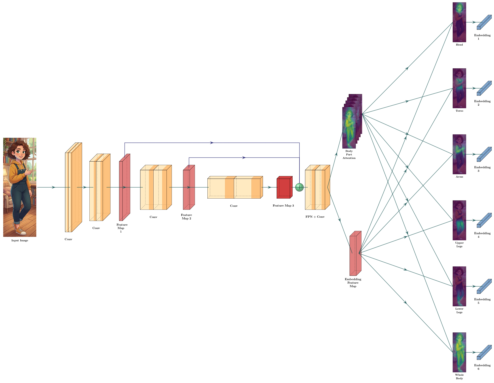
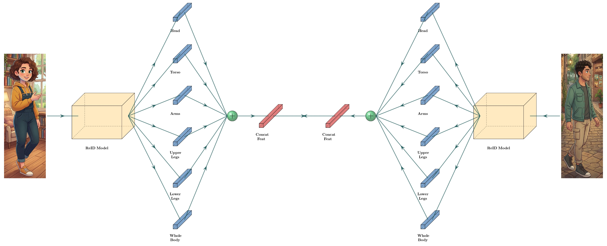
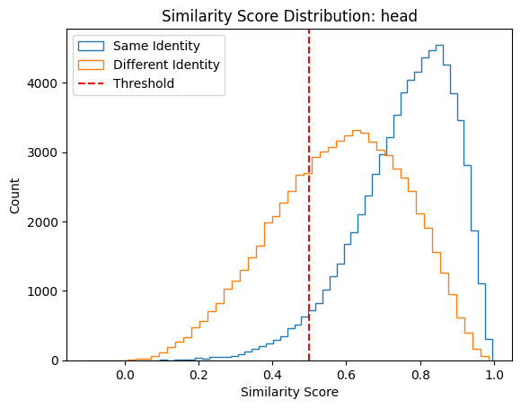
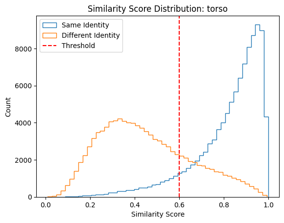
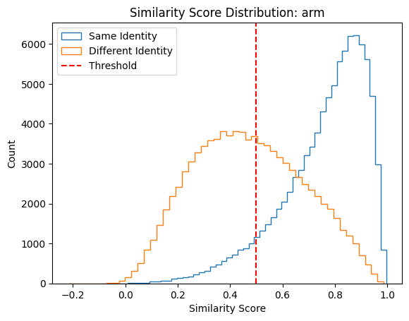
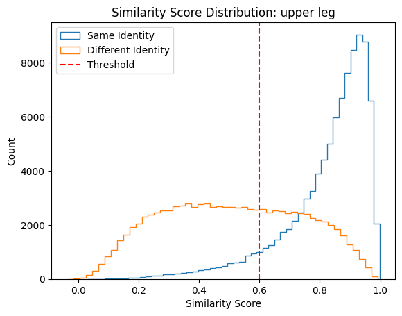
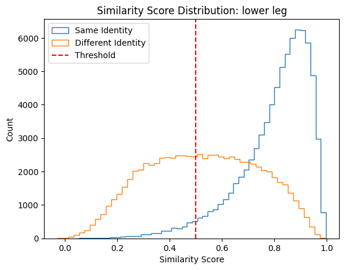

# Real-time Person Re-Identification with Body Part Segmentation

This repository contains a real-time person re-identification (Re-ID) system optimized for high-performance inference on edge devices. The model is inspired by [**BPBReID** (Body-Part-Based Re-Identification)](https://github.com/vlsomers/bpbreid), utilizing a CNN-based architecture to segment body parts and extract localized embedding vectors for robust matching.

By prioritizing inference speed for real-time applications, this model may sacrifice some absolute accuracy compared to heavier architectures. As such, it is particularly well-suited for use as a high-speed filter to narrow down potential candidates, which can then be further refined by more computationally intensive models if necessary.

## Model Overview

The system identifies individuals by segmenting the body into five key parts: **Head**, **Torso**, **Arms**, **Upper Legs**, and **Lower Legs**.

- **Input**: Image tensor.
- **Output 1**: Visibility score for each body part (range [0, 1]).
- **Output 2**: Embedding vector for each body part.

### Architecture

#### Feature Extraction

The model uses **MobileNetV3** as its backbone for high-speed inference, coupled with a **Feature Pyramid Network (FPN)** structure for high-resolution segmentation.

- **Segmentation as Attention**: Feature maps from various levels of the backbone are combined to generate both an embedding feature map and a segmentation map. The segmentation map acts as an attention mechanism; the model calculates weighted averages of the embedding map against these segments to extract part-specific features.
- **Local Feature Focus**: To prioritize local details and minimize global noise, the embedding feature map is derived primarily from shallow feature maps, while the segmentation map utilizes a combination of deep, shallow, and intermediate maps.

_Visual representation of the feature extraction and segmentation process._

#### Comparison & Metrics

Matching between two images is performed using the **cosine similarity** of each body part's embedding. Then each part-level similarity is combined into a single similarity score. Each part's similarity is weighted by its corresponding visibility score to account for occlusions or missing parts. For example, if the "Arms" part is not visible in one image, its similarity score will have less influence on the overall comparison.

_Visual representation of the comparison process._

When combining the part-level similarities into a single score, most common approach would be a weighted mean. However, when comparing two people, a single significant difference (e.g., different shoes on otherwise similar outfits) is often enough to determine they are different individuals. Therefore we consider the **"weakest link"** among the part-level similarities rather than just an average, so that a single low similarity in one part can decisively indicate a mismatch.

In order to implement this "weakest link" approach, we experimented with various methods of combining the part-level similarities, and found that the **Product** method provided the best performance.

\$\$ Similarity\_{total} = \prod\_{i=1}^{n} \left( (1-v_i) + v_i \cdot \text{remap}\_i(\text{cos\\\_sim}(f_i, g_i)) \right) \$\$

We take the product of part-level similarities, where each part's contribution is weighted by its visibility score \$v_i\$. If a part is not visible (\$v_i \approx 0\$), it contributes a neutral value of 1 to the product, effectively ignoring that part. If a part is fully visible (\$v_i \approx 1\$), its similarity score has full influence on the final similarity.

Furthermore, each part-level similarity score undergoes **logistic remapping**. This is necessary because different body parts (e.g., Torso vs. Legs) may have different optimal similarity thresholds due to their varying descriptive power or commonality.

\$\$ \text{remap}\_i(x) = \frac{1}{1 + \frac{1 - V}{V} \left( \frac{\tau_i}{1 - \tau_i} \cdot \frac{1 - x}{x} \right)^k }, \quad x \in (0, 1) \$\$

The remapping process aligns the chosen optimal threshold \$\tau_i\$ for each body part to a uniform value \$V\$, along with a steepness parameter \$k\$ that controls how sharply the remapping transitions around the threshold. Default values are \$V = 0.7\$ and \$k = 2\$.

The optimal threshold for each body part is carefully selected to maximize true positives while maintaining clear separability between different individuals. The core philosophy is to decisively eliminate candidates that are "surely different" while retaining those that are "potentially the same."

  
  
  

  
  

### Training

The model was trained using a multi-task approach:

- **Segmentation**: Trained on the **COCO DensePose** dataset using **Focal Loss**.
- **Feature Extraction**: Trained on Re-ID datasets from **AI Hub** (a Korean government-funded platform) using a combination of **Classification Loss** and **Triplet Loss**.

In order to reproduce the realistic conditions, the training data is augmented with random cropping and random resizing.

---

## Live Demo

A live demo of this system is available here:  
👉 **[https://juhonamnam.github.io/realtime-re-id/](https://juhonamnam.github.io/realtime-re-id/)**

The demo runs entirely in your browser using `onnxruntime-web` and your webcam.

### How to use:

1.  **Snapshot**: Capture a frame where people are visible.
2.  **Selection**: Click on one of the detected people to set them as the target.
3.  **Tracking**: The system will now track and identify people in the live feed:
    - **Red Bounding Box**: The model identifies the person as the target.
    - **Yellow Bounding Box**: The model identifies the person as a different individual.

---

## Project Structure

- `/re-id`: Python source code for model training, evaluation, and ONNX export.
- `/web`: React-based web application for real-time inference.
